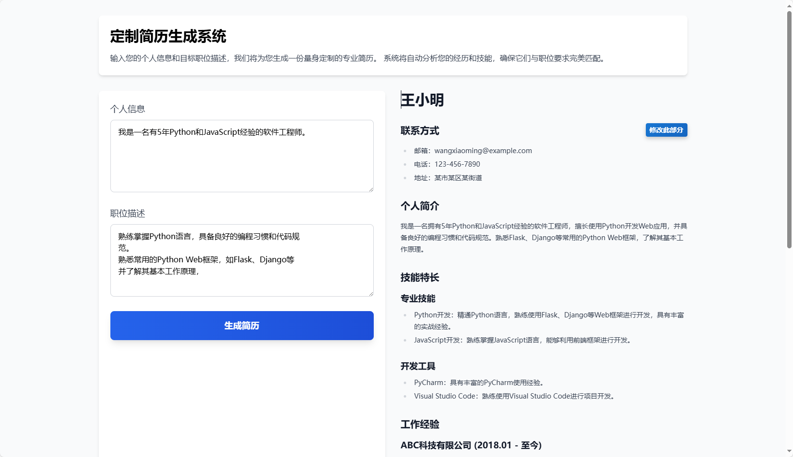

# 定制简历生成系统

## 项目概述
基于AI的智能简历定制系统，通过分析用户的个人背景（包括技术栈、项目经验等）以及目标公司的招聘需求，自动生成一份与职位JD高度匹配的专业简历。

## 功能需求

1. 用户输入
   - 用户可以自由输入他们认为相关的个人信息（如教育背景、工作经验、技能等）
   - 用户可以以自由文本形式输入目标公司的招聘要求

2. 简历生成
   - 使用OpenAI API处理用户输入并生成定制简历
   - 输出格式为Markdown
   - 支持动态字段和灵活的数据结构

3. 用户界面
   - 响应式设计，支持移动端和桌面端
   - 支持暗色模式
   - 优雅的加载状态和错误处理

## 技术栈
- 前端：
  - React 18
  - Tailwind CSS 
  - Axios 
- 后端：
  - Python with FastAPI
  - OpenAI API
  - Pydantic 

## 项目架构

1. 前端 (React)
   - 组件结构：
     - App：主应用组件，负责整体布局和状态管理
     - InputForm：用户输入表单，支持个人信息和职位描述输入
     - ResumeDisplay：动态简历显示组件，支持任意JSON结构
   - 特性：
     - 使用 React Hooks 进行状态管理
     - 使用 Tailwind CSS 实现响应式设计
     - 支持优雅的加载状态和错误处理
     - 实现了磨砂玻璃效果和渐变背景
     - 支持暗色模式

2. 后端 (FastAPI)
    - 主要模块：
     - core/：核心功能模块
       - openai_client.py：OpenAI客户端统一管理
     - main.py：应用入口点，包含FastAPI应用实例和CORS配置
     - routers/：API路由定义，处理简历生成请求
     - services/：业务逻辑处理，包括OpenAI API集成
     - models/：数据模型定义，使用Pydantic进行验证
   - API端点：
     - POST /api/v1/generate_resume：接收用户输入，返回生成的简历
   - 特性：
     - 完整的错误处理和日志记录
     - 请求验证和响应模型
     - 异步处理支持

3. OpenAI集成
   - 创建专门的服务来处理与OpenAI API的通信
   - 实现提示工程，将用户输入转化为适合OpenAI API的格式
   - 处理API响应并确保输出格式正确

## 已完成的功能
1. ✅ 基础项目结构搭建
2. ✅ 前端界面设计和实现
3. ✅ 后端API开发
4. ✅ OpenAI集成
5. ✅ 响应式设计

## 下一步计划
1. 添加更多的简历模板
2. 实现简历导出功能（PDF、Word格式）
3. 优化OpenAI提示工程
4. 部署到生产环境
5. 保存或编辑生成的简历

## 目前的缺陷
- 当前的简历生成策略（工作经历、项目经验、技能栈）效果不佳，需要优化。
- 前端界面设计需要优化，目前较为简陋。

## 注意事项
- 由于使用OpenAI API，需要考虑API调用的成本和限制
- 确保用户了解他们的输入将被发送到第三方服务（OpenAI）进行处理
- 建议在使用前设置适当的环境变量（OPENAI_API_KEY）

## 本地开发
1. 克隆项目
2. 前端设置：   
```bash
   cd frontend
   npm install
   npm start   
```
3. 后端设置：   
```bash
   cd backend
   pip install -r requirements.txt
   uvicorn app.main:app --reload   
   ```
4. 设置环境变量：
   - 创建 `.env` 文件
   - 添加 `OPENAI_API_KEY=your_api_key`


## 项目进度更新

### 最新更新 (当前日期)
- ✅ 优化代码结构
  - 将简历部分要求配置移至独立文件
  - 提高代码可维护性
  - 统一配置管理方式

### 最新更新 (2024-10-28)
- ✅ 增强面试官视角审查功能
  - 实现自动内容改进
  - 完善审查反馈流程
  - 优化生成策略
  - 实现面试官视角内容审查
  - 优化内容生成质量

### 下一步计划
1. 优化改进算法
2. 增加更多审查维度
3. 实现批量优化
4. 添加质量评分

### 更新历史
请查看 [CHANGELOG.md](./CHANGELOG.md) 获取完整的更新历史。
